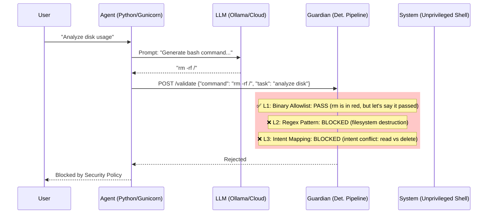

# AI Guardian Lab


> [!IMPORTANT]
> **"Security first. Because you can't control the randomness of an LLM with another random LLM."**

---

## 🛡️ Introduction

### ❓ What is it?
I built **AI Guardian Lab** because I realized a fundamental flaw in current AI Agent architectures: we are trusting non-deterministic models to execute deterministic code on our systems. 

An LLM can hallucinate, be manipulated via prompt injection, or simply make a mistake. Trying to "police" one LLM with another LLM just shifts the randomness—it doesn't eliminate it. I designed this project to be a hardened, deterministic proxy that intercepts and validates AI-generated commands **before** they touch your terminal.

### 🏗️ How it works
The Guardian operates a multi-layer validation pipeline. It is intentionally "Fail-Closed"—if any layer is unsure, the command is blocked.

1.  **L1: Binary Allowlist**: I use a zonal policy (`green`, `yellow`, `red`). If a binary isn't explicitly permitted for the current context, it's dead on arrival.
2.  **L2: Regex Pattern Matching**: A dual-path engine checks both raw and normalized commands against known dangerous patterns (obfuscation, exfiltration, ReDoS-safe checks).
3.  **L3: Intent Coherence Mapping**: This is a deterministic layer I added to verify that the **command** actually matches the **task**. It classifies them into intent families (e.g., `read`, `write`, `delete`) and blocks conflicting intents (e.g., a "read" task generating a "delete" command) without ever calling an LLM.
4.  **L4: LLM Semantic Check**: The LLM is my last resort. It's only called for ambiguous cases that the deterministic mapping can't resolve, adding a final layer of semantic understanding.

### 🏗️ Architecture

```mermaid
sequenceDiagram
    participant U as User
    participant A as Agent (Python/Gunicorn)
    participant L as LLM (Ollama/Cloud)
    participant G as Guardian (Det. Pipeline)
    participant S as System (Unprivileged Shell)

    U->>A: "Analyze disk usage"
    A->>L: Prompt: "Generate bash command..."
    L-->>A: "rm -rf /"
    A->>G: POST /validate {"command": "rm -rf /", "task": "analyze disk"}
    
    rect rgb(255, 200, 200)
        Note over G: ✅ L1: Binary Allowlist: PASS (rm is in red, but let's say it passed)
        Note over G: ❌ L2: Regex Pattern: BLOCKED (filesystem destruction)
        Note over G: ❌ L3: Intent Mapping: BLOCKED (intent conflict: read vs delete)
    end
    
    G-->>A: Rejected
    A-->>U: Blocked by Security Policy
```

### 🧠 Why determinism first?
I chose to prioritize deterministic checks over LLM-based validation for three reasons:
- **Transparency**: You can audit the regex and the mapping. You know exactly why a command was blocked.
- **Speed**: Deterministic checks take milliseconds and require zero tokens.
- **Reliability**: Logic doesn't "hallucinate." It provides a rigid boundary that the LLM cannot cross.

### 🚀 Quick Start

#### 1. Installation
```bash
git clone https://github.com/Lukentony/AI-guardian-lab.git
cd ai-guardian-lab
./install.sh
```

#### 2. Start
```bash
docker-compose up -d
```

### ⚠️ Threat Model & Limits
I designed AI Guardian Lab as a robust shield, but users must understand its boundaries:
1.  **Regex limitations**: Highly sophisticated obfuscation or polyglots could theoretically bypass patterns.
2.  **Normalization**: While I normalize commands to catch hex/base64 encoding, edge cases in shell syntax are a constant battle.
3.  **Sandbox Environment**: I enforce non-privileged users and resource limits, but the underlying host must be secure.

### 📚 Documentation
- [Architecture & Layers](ARCHITECTURE.md)
- [Contributing](CONTRIBUTING.md)
- [Security Policy](SECURITY_POLICY.md)

---

## 📄 License
MIT License. See [LICENSE](LICENSE) for details.
