# AI Guardian Lab


---

## 🛡️ Introduction

> **A "Firewall" security system for AI-generated commands.**

### ❓ What is it?
AI Guardian Lab intercepts and analyzes commands generated by **LLMs (Large Language Models)** and autonomous **AI Agents** **before** they are executed on your terminal.

It acts as a shield protecting your system from:
- AI Hallucinations (unintentional errors).
- Malicious or compromised Agents ("Prompt Injection").
- Destructive or risky commands (`rm -rf`, data exfiltration).

### 💡 Why is it useful?
Using AI Agents that operate on your PC is the future, but it's dangerous.
- **Without Guardian**: An Agent mistakes a task and runs `rm -rf /`. -> 💀 Data lost.
- **With Guardian**: The Agent tries `rm -rf /`. -> 🛡️ **BLOCKED**. Sleep soundly while AI works for you.

Ideal for:
- 🧪 **Safe Experimentation** with local AI Agents.
- 🏢 **DevSecOps**: Integrating LLMs into CI/CD pipelines without risk.
- 🎓 **Portfolio**: Practical demonstration of "AI Engineering" and security.

### ⚡ No GPU? No Problem!
Don't have a powerful computer with an NVIDIA GPU? **You can use the Cloud!**
- **Groq**: Extremely fast and offers a generous **FREE** tier.
- **OpenAI / Anthropic / Gemini**: Natively supported.
*The installer will help you configure everything in seconds.*

### 🏗️ Architecture

```mermaid
sequenceDiagram
    participant U as User
    participant A as Agent (Flask)
    participant L as LLM (Ollama/Cloud)
    participant G as Guardian (Security)
    participant S as System (Bash)

    U->>A: "Analyze disk usage"
    A->>L: Prompt: "Generate bash command..."
    L-->>A: "df -h"
    A->>G: POST /validate {"cmd": "df -h"}
    
    rect rgb(200, 255, 200)
        Note over G: ✅ Pattern Check: OK
    end
    
    G-->>A: Approved
    A->>S: Execute `df -h`
    S-->>A: Output
    A-->>U: Result
```


### 🚀 How to use it?

#### 1. Installation (Interactive Wizard)
```bash
git clone https://github.com/your-username/ai-guardian-lab.git
cd ai-guardian-lab
./install.sh

# (Optional) Populate database with sample data
python seed_db.py
```

#### 2. Start
```bash
docker-compose up -d
```

#### 3. Example
```bash
# Execute a safe command
curl -X POST http://localhost:5001/execute \
  -H "X-API-Key: test_secret_key" \
  -H "Content-Type: application/json" \
  -d '{"task": "show disk usage"}'
```

### 📚 Documentation
- [Installation Guide](docs/INSTALL.md)
- [Troubleshooting](docs/TROUBLESHOOTING.md)
- [Architecture](ARCHITECTURE.md)
- [Security Policy](SECURITY_POLICY.md)

---

## 🤝 Contributing
Pull requests are welcome! Read [CONTRIBUTING.md](CONTRIBUTING.md) to get started.

## 📄 License
MIT License. See [LICENSE](LICENSE) for details.
