# AI Guardian Lab


> [!TIP]
> **"We prioritize security and stability over feature bloat."**

---

## 🛡️ Introduction

> **A "Firewall" security system for AI-generated commands.**

### ❓ What is it?
AI Guardian Lab intercepts and analyzes commands generated by **LLMs (Large Language Models)** and autonomous **AI Agents** **before** they are executed on your terminal. It acts as a hardened proxy that enforces a **Zero-Trust** environment for AI execution.

It acts as a shield protecting your system from:
- AI Hallucinations (unintentional errors).
- Malicious or compromised Agents ("Prompt Injection").
- Destructive or risky commands (`rm -rf`, data exfiltration).
- **Zonal Policy Violations**: Blocks unauthorized binaries automatically.

### 🏗️ Architecture

```mermaid
sequenceDiagram
    participant U as User
    participant A as Agent (Python/Gunicorn)
    participant L as LLM (Ollama/Cloud)
    participant G as Guardian (Zonal Check)
    participant S as System (Unprivileged Shell)

    U->>A: "Analyze disk usage"
    A->>L: Prompt: "Generate bash command..."
    L-->>A: "df -h"
    A->>G: POST /validate {"command": "df -h"}
    
    rect rgb(200, 255, 200)
        Note over G: ✅ Zonal Allowlist: SAFE
        Note over G: ✅ Regex Patterns: PASS
    end
    
    G-->>A: Approved
    A->>S: Execute `df -h` (Sandbox)
    S-->>A: Output
    A-->>U: Result
```


### 💎 Key Hardening Features (v1.1.1)
- **Extreme Sandboxing**: Containers run as non-privileged users with strict **CPU & Memory limits**.
- **Dual-Path Validation**: Analyzes both raw and normalized commands to catch hex/base64 bypasses.
- **Fail-Closed Policy**: Blocks every command by default unless explicitly allowed in `policy.yaml`.
- **ReDoS Protection**: Regex evaluation with mandatory timeouts to prevent Denial of Service.

### 🚀 How to use it?

#### 1. Installation (Interactive Wizard)
```bash
git clone https://github.com/Lukentony/AI-guardian-lab.git
cd ai-guardian-lab
./install.sh

# (Optional) Populate database with sample data
python seed_db.py
```

#### 2. Start
```bash
docker-compose up -d
```

#### 3. Example
```bash
# Execute a safe command
curl -X POST http://localhost:5001/execute \
  -H "X-API-Key: test_secret_key" \
  -H "Content-Type: application/json" \
  -d '{"task": "show disk usage"}'
```

### ⚠️ Threat Model & Limits

AI Guardian Lab is a **security shield**, not a **bulletproof fortress**. It is designed to mitigate risks, but it has inherent limits:

1. **Regex-based detection**: While powerful, RegEx can be bypassed (e.g., via complex obfuscation or polyglots). It is a first layer of defense.
2. **Post-Normalization Gaps**: The system normalizes commands to catch encoded payloads, but sophisticated attackers may find edge cases in the normalization logic.
3. **Internal Network Security**: This lab assumed a trusted internal network between containers. It does not implement TLS between services.
4. **LLM Trust**: The Agent relies on the LLM to generate comands. If the LLM is compromised or malicious beyond pattern detection, the system could be at risk.

**Best Practice**: Always run this system in a non-critical environment and never as `root` for production workflows.

### 📚 Documentation
- [Installation Guide](docs/INSTALL.md)
- [Troubleshooting](docs/TROUBLESHOOTING.md)
- [Architecture](ARCHITECTURE.md)
- [Security Policy](SECURITY_POLICY.md)

---

## 🤝 Contributing
Pull requests are welcome! Read [CONTRIBUTING.md](CONTRIBUTING.md) to get started.

## 📄 License
MIT License. See [LICENSE](LICENSE) for details.
